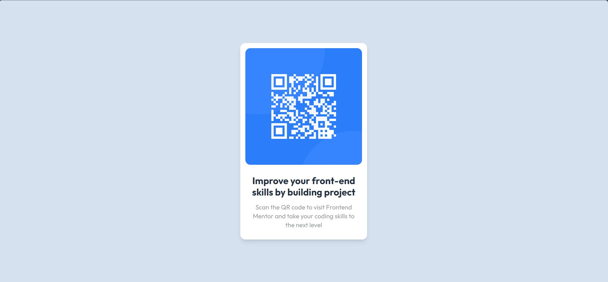

# Frontend Mentor - QR code component solution

This is a solution to the [QR code component challenge on Frontend Mentor](https://www.frontendmentor.io/challenges/qr-code-component-iux_sIO_H). Frontend Mentor challenges help you improve your coding skills by building realistic projects. 

## Table of contents

- [Overview](#overview)
  - [Screenshot](#screenshot)
  - [Links](#links)
- [My process](#my-process)
  - [Built with](#built-with)
  - [Useful resources](#useful-resources)

## Overview

### Screenshot

### Links

Live Site URL: [Github Pages]([https://your-live-site-url.com](https://nlnm-0-0.github.io/Fontend-Mentor/qr-code-component/index.html)https://nlnm-0-0.github.io/Fontend-Mentor/qr-code-component/index.html)

## My process

### Built with

- React
- Tailwind

### Useful resources

- [Github Pages for React App]([https://www.example.com](https://github.com/gitname/react-gh-pages))
